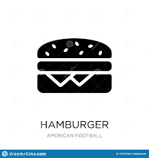
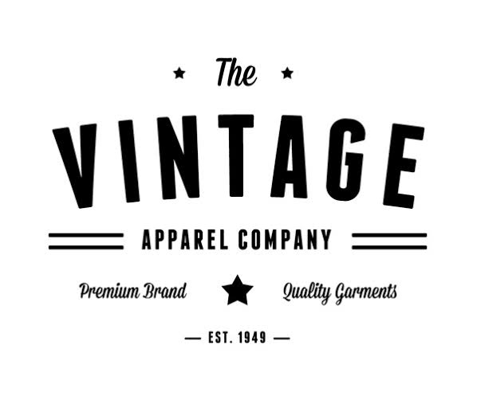

# service
<!DOCTYPE html>
<html lang="en">
<head>
  <title>Bootstrap Example</title>
  <meta charset="utf-8">
  <meta name="viewport" content="width=device-width, initial-scale=1">
  <meta name="viewport" content="width=device-width, initial-scale=1">
  <link rel="stylesheet" href="https://maxcdn.bootstrapcdn.com/bootstrap/3.4.0/css/bootstrap.min.css">
  
  

  
</head>

<body style="background-color: white">
    

        

            

                    
Thanusha SN

            

            

                
Home

            

            

                    
Resume

            

            

                    
Services

             

             

                    
Portfolio

             

             

                    
Blog

             

             

                    
Contact

             

             

        

        

                

                    <h1 style="color: white;text-align: center;padding: 10px">Services</h1>
                

                

                    

                        <h2 style="font-weight: bolder">My Services</h2>
                    

                    

                        

                            

                                
                            

                            

                                <h4 style="font-weight: bolder;text-align: center">Web Design</h4>
                            

                            

                                

                                    
<pre class="pre">
    Passionate web designer. 
Creates UX and UI with creative 
    but functional designs.</pre>  
                                

                            

                        

                        

                                

                                    
                                

                                

                                    <h4 style="font-weight: bolder;text-align: center">Photography</h4>
                                

                                

                                    

                                        <pre class="pre">
    Passionate web designer. 
Creates UX and UI with creative 
    but functional designs.
                                         </pre>
                                    

                                

                         

                         

                                

                                    
                                

                                

                                    <h4 style="font-weight: bolder;text-align: center">Management</h4>
                                

                                

                                    

                                        <pre class="pre">
    Passionate web designer. 
Creates UX and UI with creative 
    but functional designs.
                                         </pre>  
                                    

                                

                         

                         

                                

                                    
                                

                                

                                    <h4 style="font-weight: bolder;text-align: center">Advertising</h4>
                                

                                

                                    

                                        <pre class="pre">
    Passionate web designer. 
Creates UX and UI with creative 
     but functional designs.
                                        </pre>
                                    

                                

                        

                    
 
                    

                        

                            <h2 style="margin-left: 75px;margin-top:20px;font-weight: bolder">Clients</h2>
                        

                        

                            

                                

                                    
                                

                            

                            

                                

                                    
                                

                            

                            

                                

                                    
                               

                            

                            

                                

                                    
                                

                            

                            

                                

                                    
                                

                            

                            

                                

                                    
                                

                            

                        

                    

                     
                    

                        

                            <h2 style="margin-left: 75px;margin-top:20px;font-weight: bolder">Testimonials</h2>
                        
 
                       

                           

                              

                                    
                                            

                                                    

                                                            
                                                    

                                             

                                            

                                                    
Jen Havice, Conversion Copywriter

                                            

                                            

                                            

                                    
                                
  
                                

                                        
                                    

                                        

                                                The best way to give your testimonial a boost is by adding a 
                                                compelling summary sub-headline above it.
                                        
 
                                     

                                        
                                
 
                            

                           

                            

                                    
                                

                                        

                                                
                                        

                                 

                                

                                        
Jen Havice, Conversion Copywriter

                                

                                

                                

                        
                    
  
                    

                            
                        

                            

                                    The best way to give your testimonial a boost is by adding a 
                                    compelling summary sub-headline above it.
                            
 
                         

                            
                    
 
                

                            

                           

                       

                    

                        

                            <a href="#" class="previous round">&#8249;</a>
                        

                        

                            <a href="#" class="next round">&#8250;</a>
                        

                   
                    
 

                    

                        

                            <h2 style="margin-left: 45px;margin-top:20px;margin-right: 30px;font-weight: bolder">Pricing</h2>
                        
 
                        

                           

                            
                                

                                    

                                         
                                        Plan 1  
                                        $64 
                                        per month  
                                        <button type="button" class="btn button2">FREE TRIAL</button>  
                                        

                                                Lorem ipsum dolor 
                                                Pellentesque scelerisque 
                                                    Morbi eu sagittis 
                                        

                                    

                                

                            
                           

                           

                                
                                    

                                        

                                             
                                            Plan 2  
                                            $128 
                                            per month  
                                            <button type="button" class="btn button2">FREE TRIAL</button>  
                                            

                                                    Lorem ipsum dolor 
                                                    Pellentesque scelerisque 
                                                        Morbi eu sagittis 
                                                        Donec non diam 
                                            

    
                                        

                                    

                                
                               

                               

                                    
                                        

                                            

                                                 
                                                Plan 3  
                                                $256 
                                                per month  
                                                <button type="button" class="btn button2">FREE TRIAL</button>  
                                                

                                                        Lorem ipsum dolor 
                                                        Pellentesque scelerisque 
                                                            Morbi eu sagittis 
                                                            Donec non diam 
                                                            Aenean nec libero 
                                                

        
                                            

                                        

                                    
                                   

                        

                    

                

        

    

</body>
</html>
